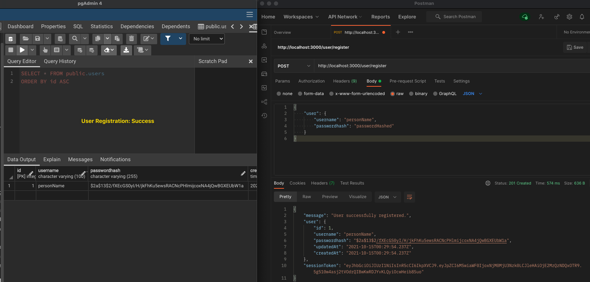
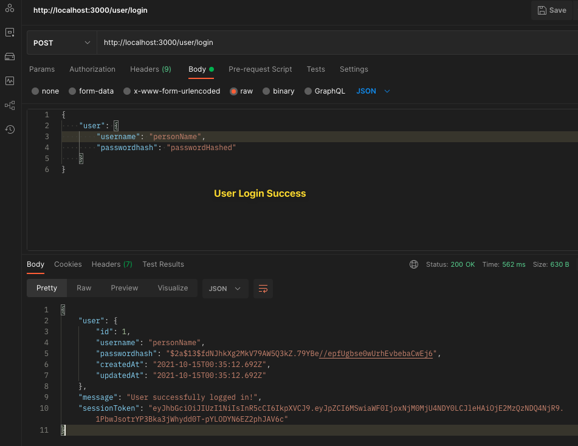
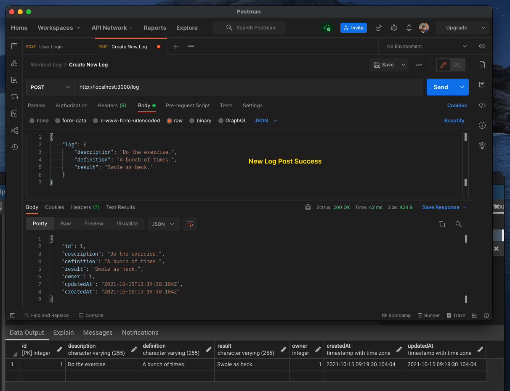
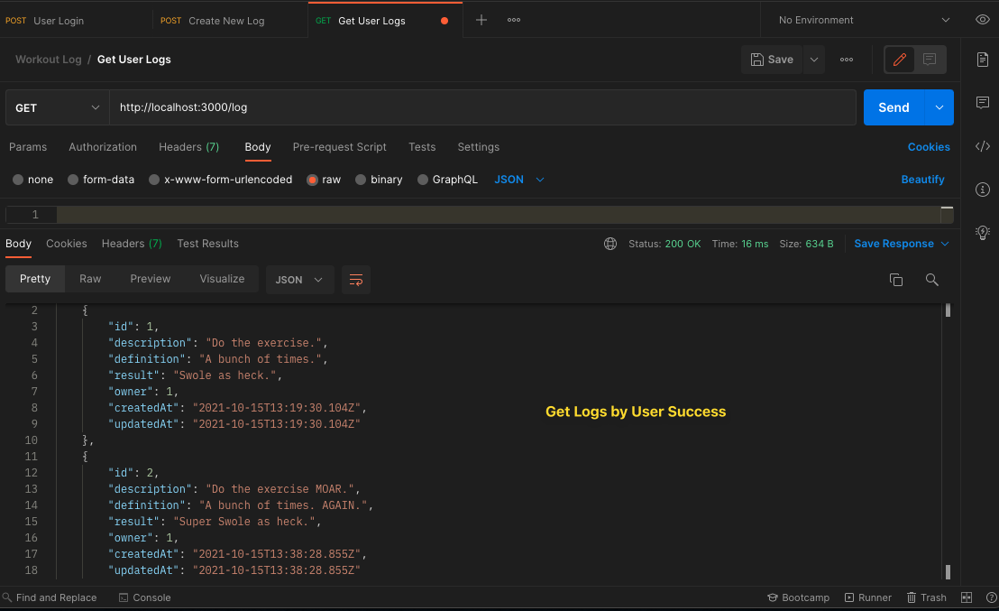
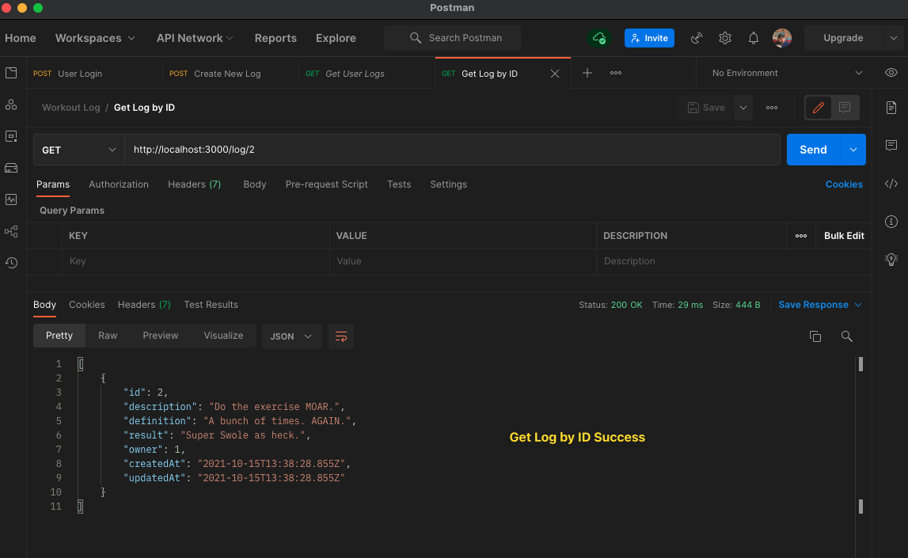
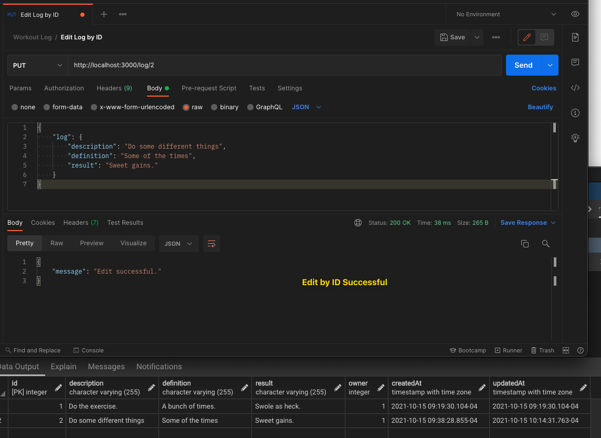
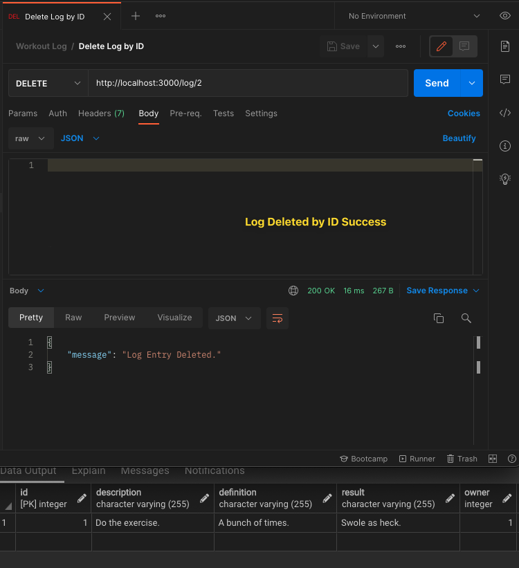

# Screenshots of Successful Postman Endpoint Testing:

### New User Registration (/user/register) (POST)

### User Login (/user/login) (POST)

### New Log Creation (/log) (POST)

### Log View By User Endpoint (/log) (GET)

### Log View By ID for User (/log/:id) (GET)

### Log Edit by ID for User (/log/:id) (PUT)

### Log Delete by ID for User (/log/:id) (DELETE)
